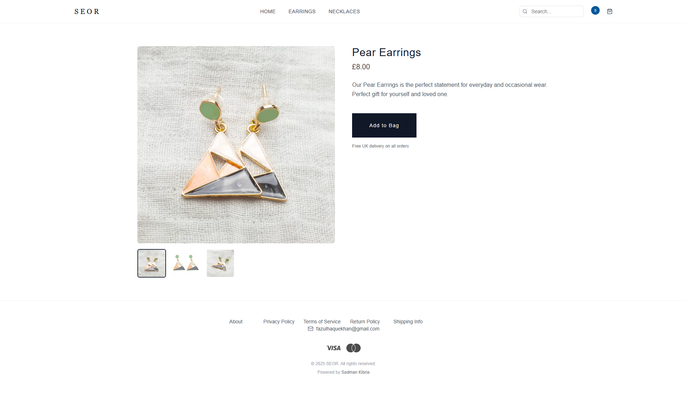

# SEOR – Contemporary Jewellery E-commerce Platform

## Table of Contents

- [Project Overview](#project-overview)
- [Screenshots](#screenshots)
- [Key Features](#key-features)
- [Technology Stack](#technology-stack)
- [Getting Started](#getting-started)
- [Project Structure](#project-structure)
- [Challenges and Solutions](#challenges-and-solutions)
- [Key Learnings](#key-learnings)
- [Future Enhancements](#future-enhancements)
- [Contact](#contact)

---

## Project Overview

SEOR is a full-stack e-commerce platform developed for a real-world client specialising in affordable, contemporary jewellery for modern women.  
This project demonstrates my ability to deliver production-ready business solutions, focused on user experience (UX), performance, security, mobile-first design and scalability.

The platform features a modern storefront, a secure checkout process with Stripe payments, a professional admin dashboard for managing products and orders and automated transactional emails powered by Resend.

It highlights my skills in:

- **Full-Stack Web Development** (Next.js 14, Prisma, PostgreSQL)
- **Modern UI/UX Design** (Tailwind CSS, Shadcn UI)
- **Database Management and ORMs** (Neon, Prisma)
- **Authentication and Security** (Clerk)
- **Payment Gateway Integration** (Stripe)
- **Transactional Email Systems** (Resend)
- **SEO Best Practices** (structured metadata, clean URLs)
- **Server Actions and Server Components** (Next.js 14 App Router)

---

## Screenshots

|                                                                             |                                                                                           |
| :-------------------------------------------------------------------------- | :---------------------------------------------------------------------------------------- |
|                             |                       |
|                          |                                  |
|  |  |

---

## Key Features

- **Mobile-First Responsive Design**: Fully optimised for all devices using Tailwind CSS.
- **Dynamic Admin Dashboard**: Securely manage products, orders, statuses and billing details.
- **Stripe Payment Integration**: Seamless and secure checkout experience.
- **Email Notifications**: Order confirmation emails sent automatically via Resend.
- **Product Search Functionality**: Real-time search across all products.
- **Multi-Image Product Support**: Upload and manage multiple product images.
- **UploadThing Integration**: Efficient, scalable image storage for products.
- **SEO Optimisation**: Dynamic meta tags, structured URLs and optimised images.
- **Authentication and Authorisation**: User and admin auth handled securely with Clerk.
- **Order Management System**: View, complete and update customer orders in the admin panel.
- **Optimised Performance**: Lazy-loading, skeleton loading states and server-side rendering.
- **Accessibility**: Semantic HTML, WCAG compliance for wider usability.

---

## Technology Stack

- **Framework**: Next.js 14 (App Router, Server Components and Server Actions)
- **Language**: TypeScript
- **Styling**: Tailwind CSS, Shadcn UI
- **Authentication**: Clerk
- **Database**: Prisma ORM with Neon (PostgreSQL)
- **Payments**: Stripe API
- **Email Provider**: Resend
- **Image Storage**: UploadThing
- **Hosting**: Vercel
- **Icons**: Lucide React
- **Notifications**: Sonner (toast notifications)

---

## Getting Started

### Prerequisites

- Node.js installed locally.
- Accounts set up on Stripe, Clerk, Neon, UploadThing and Resend.

### Installation

Clone the repository:

```bash
git clone https://github.com/SadmanKibria/seor.git
cd seor
```

Install dependencies:

```bash
npm install
```

Create a `.env` file in the root directory:

```
NEXT_PUBLIC_CLERK_PUBLISHABLE_KEY=your_clerk_publishable_key
CLERK_SECRET_KEY=your_clerk_secret_key
NEXT_PUBLIC_STRIPE_PUBLISHABLE_KEY=your_stripe_publishable_key
STRIPE_SECRET_KEY=your_stripe_secret_key
RESEND_API_KEY=your_resend_api_key
DATABASE_URL=your_neon_database_url
```

Run Prisma to push the schema:

```bash
npx prisma generate
npx prisma db push
```

Start the development server:

```bash
npm run dev
```

Open [http://localhost:3000](http://localhost:3000).

---

## Project Structure

```
seor/
├─ app/                  # Next.js App Router
│  ├─ (admin)/admin/      # Admin dashboard (products, orders)
│  ├─ (cart)/cart/        # Shopping cart
│  ├─ (checkout)/         # Checkout and payment pages
│  ├─ (static)/           # Static pages (privacy, shipping, returns, terms)
│  ├─ products/           # Products listing, categories and details
│  ├─ search/             # Product search page
│  ├─ thank-you/          # Order confirmation page
│  └─ actions/            # Server actions (create order, payment intent, etc.)
├─ components/            # Reusable UI components (navbar, footer, product cards)
├─ lib/                   # Helper functions (prisma client, formatting, etc.)
├─ prisma/                # Database schema and migrations
├─ public/                # Static assets (images, placeholders, icons)
├─ styles/                # Global styles
├─ middleware.ts          # Clerk authentication middleware
└─ config files           # ESLint, Tailwind, Prettier, Next.js configs
```

---

## Challenges and Solutions

| Challenge                                 | Solution                                                              |
| :---------------------------------------- | :-------------------------------------------------------------------- |
| Prisma client generation issues on Vercel | Added `prisma generate` during Vercel's build process                 |
| Building a real-time search function      | Designed full-text search across product names and categories         |
| Stripe integration for e-commerce         | Securely implemented client and server Stripe SDKs                    |
| Handling product image uploads            | Integrated UploadThing for secure and scalable image storage          |
| Admin order and product management UX     | Built intuitive, mobile-friendly admin dashboard with form validation |
| Email notification automation             | Integrated Resend API to handle transactional emails professionally   |

---

## Key Learnings

- **Professional Client Collaboration**: Delivered a business-grade solution based on real-world client requirements.
- **Full Next.js 14 App Router Proficiency**: Server Components, Server Actions and dynamic routes.
- **Secure Payment Handling**: Built end-to-end Stripe integration.
- **Transactional Email Management**: Practical usage of Resend for order confirmation workflows.
- **Real E-commerce Workflows**: From product management to cart, checkout and order completion.
- **Production Performance Best Practices**: Server-side rendering, dynamic imports and SEO optimisation.
- **Accessibility and Responsive Design**: Built mobile-first, accessible layouts for broader reach.

---

## Future Enhancements

- Introduce customer accounts with order history.
- Add product reviews and ratings.
- Implement CMS integration (Sanity/Contentful) for non-technical product management.
- Expand product filters (e.g., by price, material, category).
- Add multi-language (i18n) support for global reach.
- Integrate charts in admin analytics dashboard for (sales, customers and revenue).

---

## Contact

For collaborations, freelance projects, or opportunities:

- 📧 Email: [sadmankibria1@gmail.com](mailto:sadmankibria1@gmail.com)
- 🌐 Portfolio: [sadmankibria.com](https://sadmankibria.com)

---

> This client project reflects my ability to deliver production-grade full-stack applications, combining technical expertise, clean architecture, scalable infrastructure and strong UX/UI design for real-world businesses.

---
